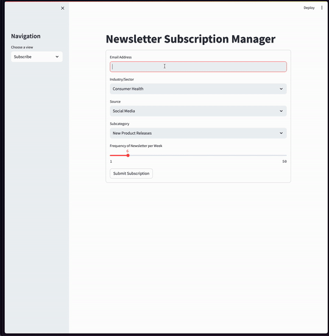

# Newsletter App
By [Sudharsan Ananth](https://sudharsan-007.github.io) 

<!-- TABLE OF CONTENTS -->
<details>
  <summary>Table of Contents</summary>
  <ol>
    <li><a href="#about-this-project">About this Project</a></li>
    <li><a href="#dependencies">Dependencies</a></li>
    <li><a href="#prerequisites">Prerequisites</a></li>
    <li><a href="#run-the-code">How to run</a></li>
    <li><a href="#license">License</a></li>
  </ol>
</details>


## About this Project 

This repo contains a code to enter email for newsletter subscription service, the idea of this app is to 
add emails to mysql serve in the background. Any user(email) can be subscribed only once, if someone who 
is already subscribed to a newsletter is trying to subscribe again, a pop up will tell the user to contact
customer care. This simple demo only simulates data entry and recovery from SQL into a front-end(streamlit).


### Demo




## Dependencies 

This project is built with the below given major frameworks and libraries. The code is primarily based on python. 

* [Python](https://www.python.org/) 
* [Matplotlib](https://matplotlib.org) 
* [Seaborn](https://seaborn.pydata.org/) 
* [Streamlit](https://streamlit.io/)

## Prerequisites

conda environment is ideal for creating environments with the right packages. Pip is required to install the dependencies. 


* [Docker](https://www.docker.com/#build)

### Or
* [Anaconda](https://www.anaconda.com) or [miniconda](https://docs.conda.io/en/latest/miniconda.html)
* [pip](https://pypi.org/project/pip/) 
* [mysql](https://www.mysql.com/)


## Run the code

Docker compose is the easiest way to run this. If not you will have to setup the mysql server along with 

### Method 1 - Using Docker
1. Clone the repository using 
   ```sh
   git clone https://github.com/sudharsan-007/newsletter_app.git
   ```

2. Run docker-compose 
   ```sh 
   docker-compose up --build
   ```

### Method 2 - Using mySQL and Python
1. Install pre-requisites Conda, pip, python, and mySQL and clone this repo 

2. Comment out `db_config` for Docker (line ~20) and configure db_config based on your mysql setup (password, username and database variables)

3. Install Dependencies in a conda environment
   ```sh
   conda create -n "newsletter_app" python=3.8
   conda activate newsletter_app
   python3 -m pip install -r requirements.txt
   ``` 

4. Run the app
    ```sh 
    streamlit run app.py

5. Play with the code and enjoy

<!-- LICENSE -->
## License

Distributed under the MIT License. See `LICENSE.txt` for more information.

<p align="right">(<a href="#top">back to top</a>)</p>